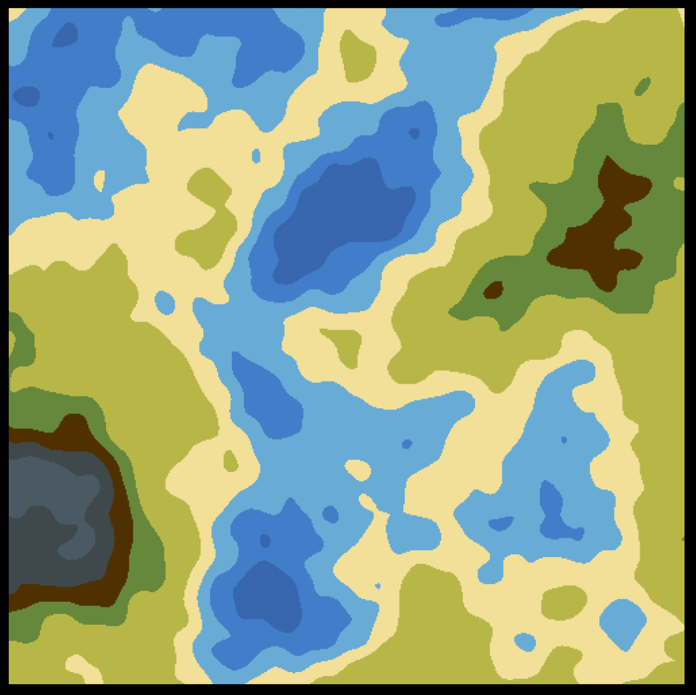
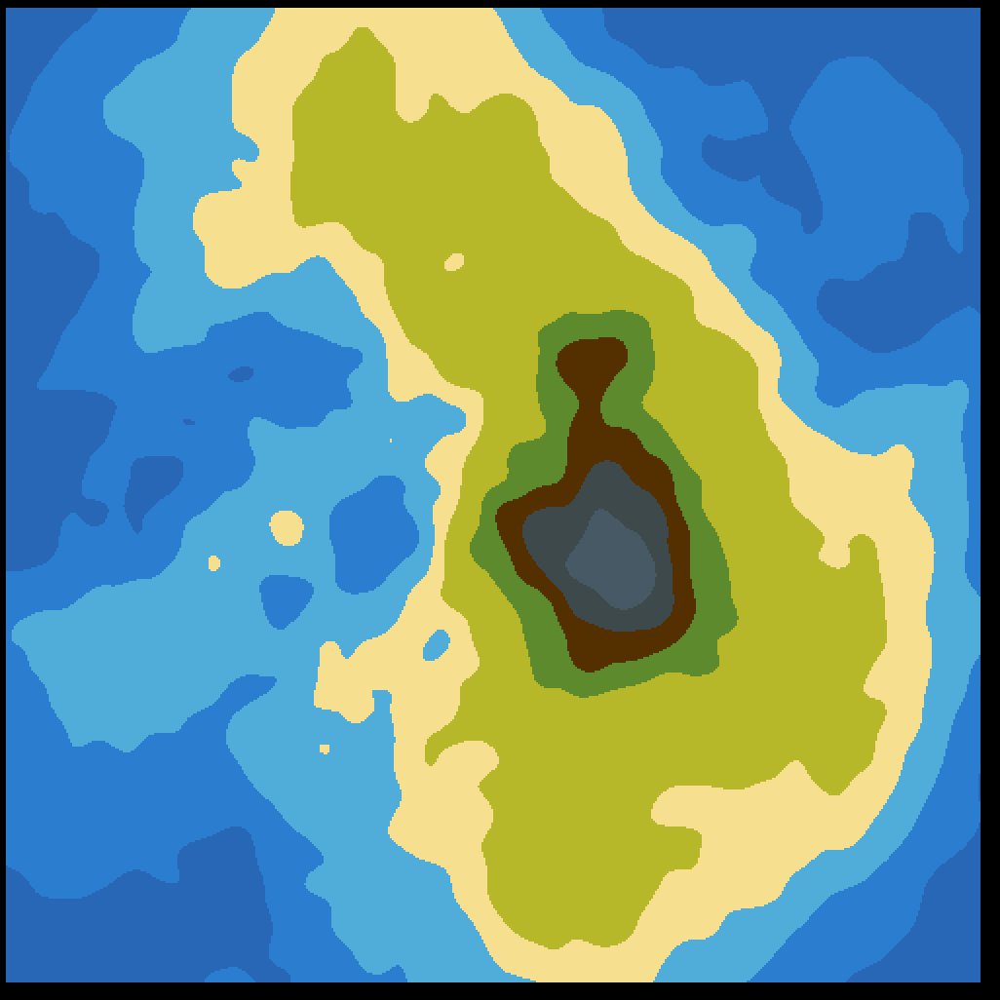

# procedural-terrain

* 2D
    * lib - [pixel](https://github.com/faiface/pixel)
    * func 
        * GenerateNoiseMap
        * GenerateNoiseMap_island
        

            
            
        

* 3D
    * lib - [g3n](https://github.com/g3n/engine)