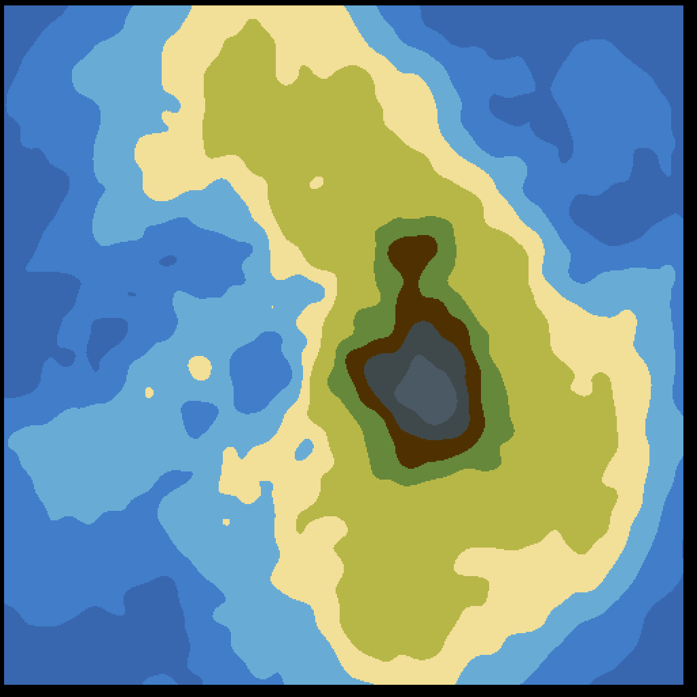

# procedural-terrain

* <u>2D</u>
    * lib - [pixel](https://github.com/faiface/pixel)
    * func 
        * GenerateNoiseMap
        * GenerateNoiseMap_island

    
     

* * <u>3D</u>
    * lib - [g3n](https://github.com/g3n/engine)